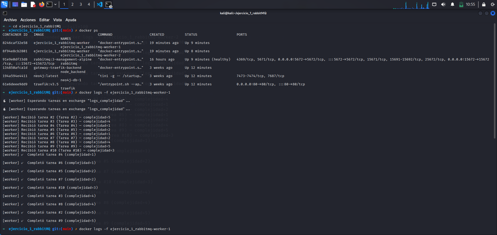
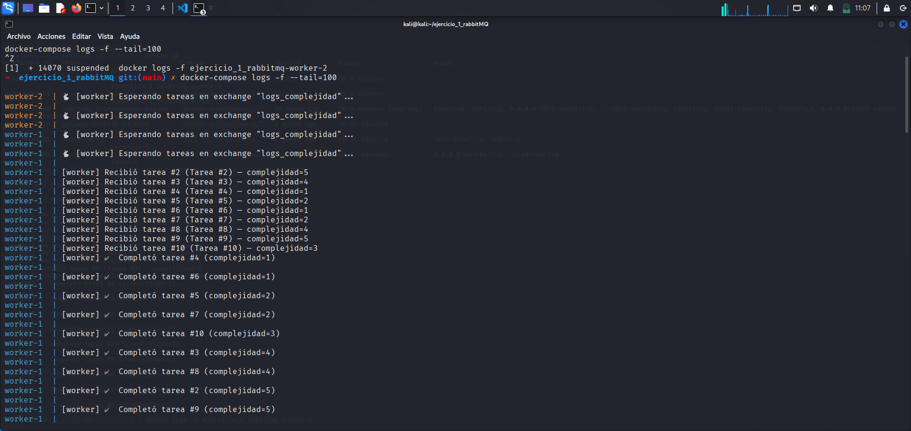
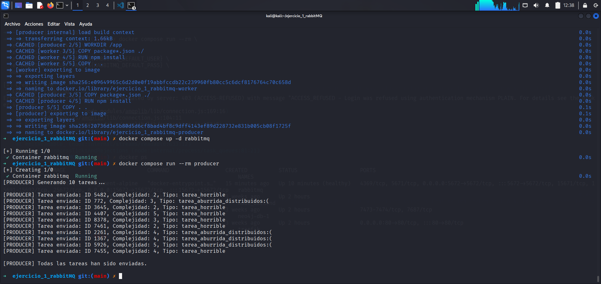

# RabbitMQ procesamiento de datos
### NOMBRES:
 Marìa Josè Espinosa Cañòn

 Julian Camilo Ceron

### ITEMS SOLICITADOS:

Para comprobar el funcionamiento, inicialmente construimos el docker-compose:

## 1. Evidencia de distribución equilibrada de tareas entre workers.
El producer envia los mensajes a la queue:

se realiza las pruebas con los logs a cada worker

## 2. Prueba de tolerancia a fallos: caída de un worker sin pérdida de la tarea.

Se evidencia en los logs del worker2, que recibe la actividad numero 4, pero falla al relizarlo (simulaciòn).Por ende, si se revisa los logs en el worker1 se visualiza que la tarea fue reencolada y ejecutada por este mismo, evidenciando que la tarea no se perdio.

## 3. Breve explicación (oral o escrita) del flujo del sistema y de los mecanismos utilizados para garantizar la fiabilidad y distribución del trabajo.

El `productor` crea las tareas y les asigna un nivel de complejidad que indica cuánto van a tardar en completarse. Luego las envía a la `cola` de `RabbitMQ`, que se encarga de guardarlas hasta que algún `worker` esté listo para procesarlas. Los workers toman las tareas de una en una para no saturarse y trabajan en ellas el tiempo que corresponde según la complejidad. Cuando terminan, le avisan a RabbitMQ que la tarea se completó. Si un `worker` falla antes de terminar, RabbitMQ se da cuenta y le asigna esa tarea a otro worker, así ninguna se pierde. De esta manera, las tareas se reparten de manera justa, los workers no se sobrecargan y todo el proceso sigue funcionando aunque algo falle.

# PUBLISH/SUSCRIBE

En Productor.py, ya no hay una cola fija; se usa un exchange llamado distribuidor_tareas que distribuye los mensajes a todos los suscriptores.

En Worker.py, cada consumidor crea una cola temporal y exclusiva, sin usar ack ni persistencia, ya que los mensajes solo se mantienen en memoria.

A continuaciòn, se levantan RabbitMQ, el productor y los workers para probar el funcionamiento.

Vemos que el productor ha publicado las tareas y  se ve como el worker 1 procesa las tareas, A continuacion se evidencia con el worker 2 lo mismo:

# ROUTING
Pasamos al patrón Routing con un exchange tipo direct en RabbitMQ: el productor etiqueta las tareas, y en lugar de recibir todo, cada worker se suscribe de forma específica a solo una de esas etiquetas, esto permite que el sistema filtre y dirija los mensajes justo a los trabajadores especializados.

